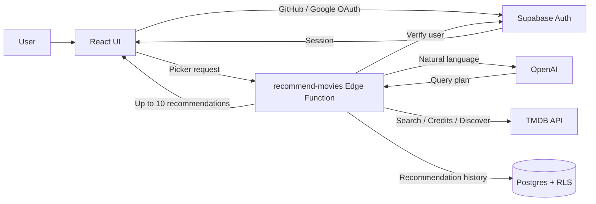

# 🍿 Movie Picker

[繁體中文](./README.md) | [English](./README.en.md) | [日本語](./README.ja.md)

> “Tired of watching the same movies? What else might you enjoy?”

Tell Movie Picker what mood you are in and what you would like to watch. AI turns your request into validated search criteria, then uses the TMDB Discover API to recommend movies or TV shows.

The frontend is built with React. Supabase handles sign-in, the database, and the Edge Function; TMDB and OMDb provide movie data, while OpenAI interprets each request.

#### 👀 Take a peek at [Movie Picker](https://movie-picker.peiwang.dev/)

## Features

- **Latest & Trending**: Browse the latest, weekly trending, popular, top-rated, and genre lists for movies and TV shows
- **Search**: Find movies and TV shows, then view details, cast, trailers, seasons, and episode counts
- **AI Picker**: Sign in and describe what you want to watch and any limits; AI builds the query, and TMDB returns up to ten titles
- **History**: View the latest 20 AI recommendation runs and delete individual entries
- **Wishlist**: Save movies and TV shows for later
- **User Sign-in**: Sign in with GitHub or Google to use the AI picker, sync your wishlist, and save recommendation history
- **Localization**: Switch between English and Traditional Chinese; responsive layouts support different screen sizes

|   feature    |             screenshot             |
| :----------: | :--------------------------------: |
| movie detail |  |
|   History    |      |
|   Wishlist   |    |

## Tech Stack

| Framework      | Used for                                                |
| -------------- | ------------------------------------------------------- |
| React 19       | Frontend UI                                             |
| TypeScript     | Static type checking                                    |
| Vite           | Local development and frontend builds                   |
| Tailwind CSS 4 | Responsive layouts and styling                          |
| shadcn/ui      | Reusable UI components                                  |
| Motion         | UI animation and reduced-motion support                 |
| React Router   | SPA routing                                             |
| TanStack Query | API fetching, caching, and server-state synchronization |
| Zustand        | Language, theme, auth, and wishlist state               |
| i18next        | English and Traditional Chinese localization            |
| Zod            | AI response and query-plan validation                   |
| Supabase       | User data, OAuth, RLS, and the Edge Function            |
| TMDB API       | Movie and TV search, discovery, and metadata            |
| OMDb API       | External movie ratings                                  |
| AI model       | Turning natural-language requests into TMDB query plans |

## Data & Persistence

| Data                      | Storage                                                                   | Purpose                                                        |
| ------------------------- | ------------------------------------------------------------------------- | -------------------------------------------------------------- |
| Wishlist                  | Browser `localStorage` while signed out; synced to Supabase after sign-in | Keeps saved movies and TV shows available across devices       |
| AI recommendation history | Supabase                                                                  | Stores picker criteria, recommendation results, and timestamps |
| User identity             | Supabase Auth                                                             | Supports GitHub and Google sign-in                             |

Row Level Security ensures signed-in users can access only their own wishlist and recommendation history.

## Architecture

- `src/pages` contains routed pages; `src/components` contains shared UI and feature components.
- `src/hooks` coordinates server state; `src/services` keeps external APIs behind clear boundaries.
- `src/stores` manages client state; `supabase/migrations` and `supabase/functions` contain backend behavior.

## Recommendation Pipeline

- **Keep AI within a clear boundary**: OpenAI can only produce a `plan_movie_search` query plan. The Edge Function validates it and calls TMDB, so the model never generates title data directly.
- **Separate explicit constraints from inferred preferences**: If there are too few results, only AI-inferred genres and keywords are relaxed. People, years, runtime, and exclusions from the user stay in place.
- **Handle ambiguous names and roles**: TMDB credits are used to distinguish actors, directors, writers, and producers. Ambiguous matches ask the user to adjust the request instead of guessing.
- **Build a predictable candidate pool**: Popular and top-rated results are fetched in parallel, deduplicated, and interleaved before returning up to ten titles.
- **Isolate slow or failed work**: OpenAI and TMDB share a 30-second deadline. Recommendation history is written in the background, so it does not delay or invalidate a completed result.

See [AI Picker, Supabase Auth, and Data Access Architecture](./docs/supabase-ai-rollout.en.md) for the full data flow and validation rules.

## Develop

Set frontend environment variables from `.env.example`. Store the OpenAI and TMDB keys used by the AI Function in Supabase Edge Function Secrets.

| Command                   | Purpose                                     |
| ------------------------- | ------------------------------------------- |
| `bun install`             | Install dependencies                        |
| `bun run dev`             | Start the local development server          |
| `bun run test:run`        | Run all tests                               |
| `bun run lint`            | Run code checks                             |
| `bun run build`           | Type-check and build the production bundle  |
| `bun run deploy:supabase` | Deploy the `recommend-movies` Edge Function |
