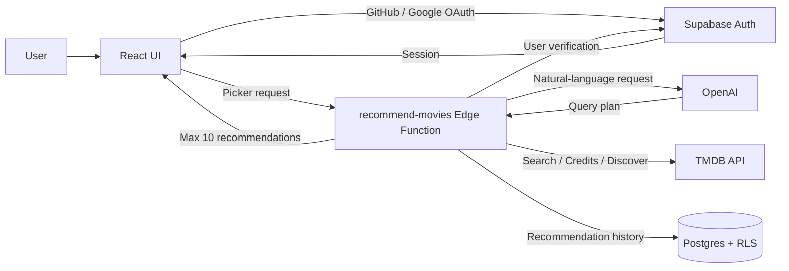

# 🍿 Movie Picker

[繁體中文](./README.md) | [English](./README.en.md) | [日本語](./README.ja.md)

> 「いつも同じ作品ばかり観てしまう。まだ知らない、自分に合う作品を見つけたい。」

今の気分や観たい作品の条件を入力すると、AI が自然言語を検証可能な検索条件に整理し、TMDB Discover API を使って映画やドラマを提案します。

Frontend は React で構築し、認証、database、Edge Function に Supabase を使用しています。作品情報は TMDB／OMDb から取得し、OpenAI が自然言語で入力された作品選びの条件を解釈します。

#### 👀 [Movie Picker を試す](https://movie-picker.peiwang.dev/)

## Feature

- **最新・トレンド**：映画とドラマの新着、週間トレンド、人気、高評価、ジャンル別リストを閲覧
- **作品検索**：映画／ドラマを検索し、詳細、キャスト、予告編、シーズン数、エピソード数を表示
- **AI Picker**：ログイン後、観たい作品と条件を自然文で入力。AI が query plan を作成し、TMDB から最大 10 作品を取得
- **History**：最新 20 件の AI 推薦履歴を表示し、1 件ずつ削除
- **Wishlist**：後で観たい映画やドラマを保存
- **ユーザーログイン**：GitHub／Google OAuth に対応。AI Picker、Wishlist の同期、推薦履歴の保存が可能
- **Localization**：英語／繁体字中国語と responsive layout に対応

|   feature    |             screenshot             |
| :----------: | :--------------------------------: |
| movie detail |  |
|   History    |      |
|   Wishlist   |    |

## Tech Stack

| Framework      | 用途                                               |
| -------------- | -------------------------------------------------- |
| React 19       | Frontend UI                                        |
| TypeScript     | 静的型チェック                                     |
| Vite           | Local development と frontend build                |
| Tailwind CSS 4 | Responsive layout と styling                       |
| shadcn/ui      | 再利用可能な UI component                          |
| Motion         | UI animation と reduced-motion support             |
| React Router   | SPA routing                                        |
| TanStack Query | API fetching、cache、server state の同期           |
| Zustand        | 言語、theme、auth、Wishlist state の管理           |
| i18next        | 英語と繁体字中国語の localization                  |
| Zod            | AI response と query plan の validation            |
| Supabase       | User data、OAuth、RLS、Edge Function               |
| TMDB API       | 映画・ドラマの search、Discover、metadata          |
| OMDb API       | 映画の外部 rating を取得                           |
| AI model       | Natural-language request を TMDB query plan に変換 |

## Data & Persistence

| Data                      | Storage                                                             | 用途                                 |
| ------------------------- | ------------------------------------------------------------------- | ------------------------------------ |
| Wishlist                  | 未ログイン時は browser `localStorage`、ログイン後は Supabase と同期 | 保存した映画やドラマを複数端末で保持 |
| AI recommendation history | Supabase                                                            | 検索条件、推薦結果、作成日時を保存   |
| User identity             | Supabase Auth                                                       | GitHub／Google ログインを管理        |

Cloud data は Row Level Security で保護され、ログイン済みのユーザーは自分の Wishlist と推薦履歴のみにアクセスできます。

## Architecture

- `src/pages` に route ごとの page、`src/components` に shared UI と feature component を配置しています。
- `src/hooks` で server state を扱い、`src/services` で external API access を分離しています。
- `src/stores` で client state、`supabase/migrations` と `supabase/functions` で backend behavior を管理しています。

## Recommendation Pipeline

- **AI の責務範囲を限定**：OpenAI が生成できるのは `plan_movie_search` query plan のみです。Edge Function で validation してから TMDB を呼び出し、AI model に作品情報を直接生成させません。
- **Explicit constraints と inferred preferences を分離**：結果が少ない場合でも、緩和するのは AI が推測した genre と keyword だけです。ユーザーが指定した人物、年代、runtime、除外条件は保持します。
- **同名と role の曖昧さを解決**：TMDB credits を使い、actor、director、writer、producer を区別します。候補を一意に決められない場合は推測せず、条件の調整を促します。
- **再現性のある candidate pool を構築**：popularity 順と rating 順の結果を並列で取得し、重複を除いて交互に統合した後、最大 10 作品を返します。
- **遅延と書き込み失敗を分離**：OpenAI と TMDB への request に共通の 30 秒 timeout を設けています。推薦履歴は background write にし、履歴の保存失敗が完了済みの response に影響しないようにしています。

Data flow と validation rule の詳細は、[AI Picker、Supabase Auth、Data Access Architecture](./docs/supabase-ai-rollout.en.md)（English）を参照してください。

## Develop

Frontend の environment variables は `.env.example` を参照して設定します。AI Function が使用する OpenAI と TMDB の key は Supabase Edge Function Secrets に保存してください。

| Command                   | 用途                                       |
| ------------------------- | ------------------------------------------ |
| `bun install`             | 依存 package をインストール                |
| `bun run dev`             | Local development server を起動            |
| `bun run test:run`        | すべての test を実行                       |
| `bun run lint`            | Lint を実行                                |
| `bun run build`           | Type check 後、production bundle を生成    |
| `bun run deploy:supabase` | `recommend-movies` Edge Function を deploy |
