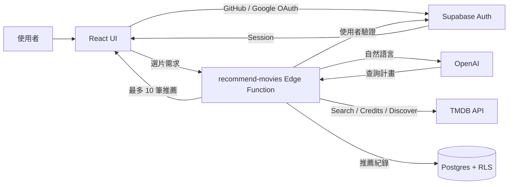

# 🍿 Movie Picker

[繁體中文](./README.md) | [English](./README.en.md) | [日本語](./README.ja.md)

> 「看的電影總是那幾部？有沒有其他我沒聽過、或許很適合我的片單？」

讓 Movie Picker 提供給你幾個電影提案吧！
輸入**此刻心情、想看的電影描述**，由 AI 將自然語言整理成可驗證的查詢條件，再透過 TMDB Discover API 推薦電影或影集。

此專案使用 React 建立前端，由 Supabase 提供登入、資料庫與 Edge Function；電影資料來自 TMDB／OMDb，OpenAI 負責解析使用者的選片需求。

#### 👀 Take a peek at <u>[Movie Picker](https://movie-picker.peiwang.dev/)</u>

## Feature

- **最新趨勢**：切換電影與影集的最新、每週趨勢、熱門、高評分及各種類型
- **電影搜尋**：搜尋電影／影集，查看詳情、演員、預告片、影集季數與總集數
- **AI 選片**：登入後使用，以自然文字描述期待與限制，由 AI 規劃查詢、TMDB 回傳最多十部作品
- **History**：需登入使用，AI 選片歷史紀錄，最多載入 20 筆，支援單筆刪除
- **Wishlist**：電影願望清單
- **使用者登入**：支援 GitHub／Google OAuth；登入後可使用 AI 選片、同步收藏並保存推薦紀錄
- **Localize**：支援英文／繁體中文，RWD 支援各裝置大小

|   feature    |             screenshot             |
| :----------: | :--------------------------------: |
| movie detail |  |
|   History    |      |
|   Wishlist   |    |

## Tech Stack

| Framework      | Used for                                |
| -------------- | --------------------------------------- |
| React 19       | Frontend interface library              |
| TypeScript     | Static type checking                    |
| Vite           | 本機開發與前端建置                      |
| Tailwind CSS 4 | CSS style                               |
| shadcn/ui      | Reusable UI components                  |
| Motion         | UI 動畫與降低動態效果支援               |
| React Router   | SPA routing                             |
| TanStack Query | API 資料取得、快取與伺服器狀態同步      |
| Zustand        | 管理語言、主題、登入與收藏狀態          |
| i18next        | localization                            |
| Zod            | 驗證 AI API 資料與查詢計畫              |
| Supabase       | 使用者資料、OAuth、RLS 與 Edge Function |
| TMDB API       | 搜尋、瀏覽與顯示電影及影集資料          |
| OMDb API       | 取得電影外部評分                        |
| AI 模型        | 將自然語言需求轉換為 TMDB 查詢計畫      |

## Data & Persistence

| 資料        | 保存位置                                                 | 用途                             |
| ----------- | -------------------------------------------------------- | -------------------------------- |
| 收藏清單    | 未登入時使用瀏覽器 `localStorage`；登入後同步至 Supabase | 跨裝置保留想看的電影與影集       |
| AI 推薦紀錄 | Supabase                                                 | 保存選片條件、推薦結果及產生時間 |
| 使用者身分  | Supabase Auth                                            | 支援 GitHub／Google 登入         |

所有雲端資料均受 Row Level Security 保護，登入使用者只能存取自己的收藏與推薦紀錄

## Architecture

- `src/pages` 管理路由頁面，`src/components` 放共用 UI 與功能元件。
- `src/hooks` 協調伺服器狀態，`src/services` 隔離外部 API。
- `src/stores` 管理前端狀態，`supabase/migrations` 與 `supabase/functions` 管理後端行為。

## Recommendation Pipeline

- **限制 AI 的責任**：OpenAI 只能產生 `plan_movie_search` 查詢計畫，由 Edge Function 驗證後呼叫 TMDB，避免模型直接產生作品資料。
- **區分明確條件與推測偏好**：結果不足時，只放寬 AI 推測的類型與關鍵字，保留使用者指定的人物、年份、片長與排除條件。
- **處理人物同名與工作類型**：人物名稱會結合 TMDB credits 判斷演員、導演、編劇或製作人；結果有歧義時請使用者調整條件，不自動猜測。
- **建立可預期的候選池**：並行取得熱門與高評分結果，去重並交錯合併後回傳最多 10 部作品，避免排序只偏向單一指標。
- **隔離慢速或失敗操作**：OpenAI 與 TMDB 共用 30 秒請求期限；推薦紀錄改為背景寫入，不會延後或推翻已完成的推薦。

完整的資料流與驗證規則請見 [AI 選片、Supabase Auth 與資料權限架構](./docs/supabase-ai-rollout.md)。

## Develop

前端環境變數依照 `.env.example` 設定；AI Function 使用的 OpenAI 與 TMDB 金鑰另外放在 Supabase Edge Function Secrets。

| 指令                      | 用途                                  |
| ------------------------- | ------------------------------------- |
| `bun install`             | 安裝依賴                              |
| `bun run dev`             | 啟動本機開發環境                      |
| `bun run test:run`        | 執行全部測試                          |
| `bun run lint`            | 檢查程式碼                            |
| `bun run build`           | 型別檢查並建立 production bundle      |
| `bun run deploy:supabase` | 部署 `recommend-movies` Edge Function |
