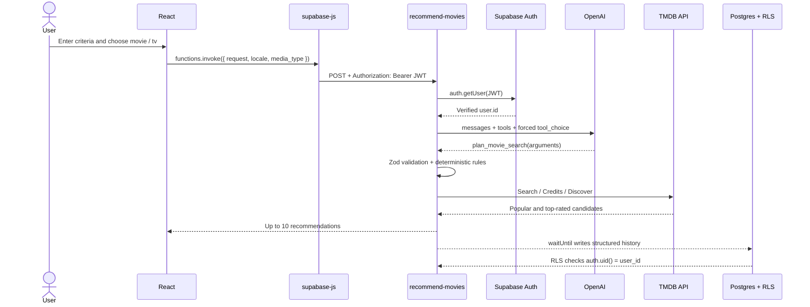
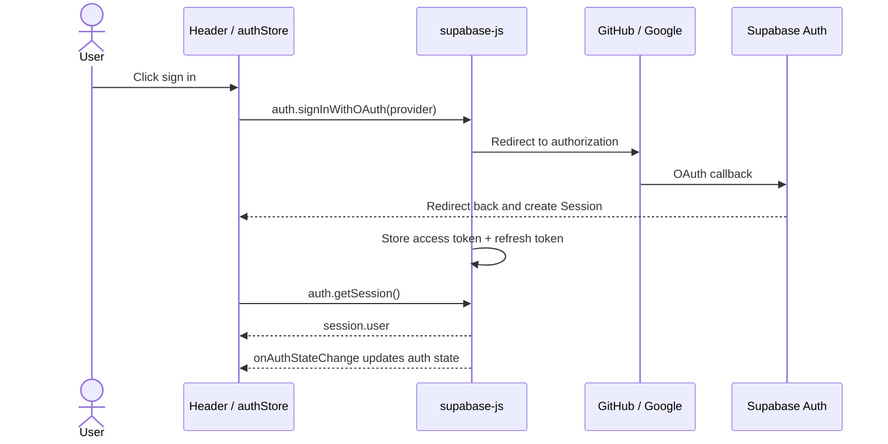

# AI Picker, Supabase Auth, and Data Access Architecture

[繁體中文](./supabase-ai-rollout.md) | [English](./supabase-ai-rollout.en.md)

This document explains Movie Picker's AI recommendation design, OAuth sign-in, and Session/JWT flow.

## Recommendation Flow at a Glance

After signing in, the user describes what they want to watch. AI turns the request into a structured query plan, the Edge Function validates the plan and searches TMDB, and Supabase RLS keeps each recommendation record private to its owner.

## System Boundaries

| Layer                            | Responsibility                                                    |
| -------------------------------- | ----------------------------------------------------------------- |
| React                            | Collects picker criteria and displays auth state and results      |
| Supabase Auth                    | Handles GitHub/Google OAuth and manages the Session               |
| `recommend-movies` Edge Function | Verifies the user, coordinates OpenAI and TMDB, and saves history |
| OpenAI                           | Turns natural-language requests into constrained query plans      |
| TMDB                             | Provides people, keywords, titles, and Discover data              |
| Postgres + RLS                   | Stores wishlists and history while isolating each user's data     |

## AI Recommendation Request Flow

### Function Calling and Query Plan Validation

Function calling does not give the model direct access to TMDB. The model can only return arguments for `plan_movie_search`; the Edge Function owns every real API request.

Important settings:

| Setting                 | Value                      | Purpose                                            |
| ----------------------- | -------------------------- | -------------------------------------------------- |
| `tools`                 | Only `plan_movie_search`   | Limits the model to building a query plan          |
| `tool_choice`           | Forces `plan_movie_search` | Rejects free-form answers                          |
| `strict`                | `true`                     | Requires output that follows the JSON Schema       |
| `additionalProperties`  | `false`                    | Rejects fields that are not defined in the schema  |
| `temperature`           | `0`                        | Reduces variation between plans for the same input |
| `max_completion_tokens` | `900`                      | Caps output length and cost                        |
| Default model           | `gpt-4o-mini`              | Can be overridden with the `OPENAI_MODEL` Secret   |

The tool schema separates the plan into:

- `hard_constraints`: Requirements that must not be relaxed, such as excluded genres, year, runtime, language, or country.
- `soft_preferences`: Genre, keyword, and mood preferences marked as either user-provided `explicit` values or model-inferred `inferred` values.
- `people`: Up to two actors, directors, writers, or producers.
- `people_match`: Whether any named person can match or all of them must share a title.
- `display_labels`: The applied criteria shown to the user.

Model output is still untrusted input, so the backend also:

1. Parses the arguments from the required tool call.
2. Uses Zod to validate types, string lengths, array limits, and the allowed genres for movies and TV shows.
3. Applies deterministic rules. For example, "a shorter movie" always maps to a runtime of 60–90 minutes.
4. Returns `media_type_mismatch` when the text explicitly asks for a movie but the UI is set to TV, instead of letting the model change the media type.

### Turning a Query Plan into Real Recommendations

1. TMDB Search resolves people and keywords. If a name is ambiguous, the request returns an adjustable error instead of guessing.
2. Movie actors use `with_cast`. Directors, writers, producers, and TV people are matched through credits by department/job before title IDs are intersected.
3. The Edge Function runs `popularity.desc` and `vote_average.desc` Discover requests in parallel.
4. Both result sets are interleaved and deduplicated into a pool of up to 20 candidates, then the first 10 are returned.
5. If there are too few results, only model-inferred genres and keywords may be removed. User-provided constraints always remain.

AI understands the request, TMDB provides real titles, and application code owns validation, search, and ranking.

## Sign-in Flow

1. `Providers` calls `authStore.initializeAuth()`.
2. `getSession()` sets the initial UI state; `onAuthStateChange()` handles later sign-ins, token refreshes, and sign-outs.
3. `supabase-js` attaches the Session JWT when it invokes the Function.
4. The Edge Function uses `auth.getUser()` to obtain the verified `user.id`; it does not accept a user ID from the frontend.
5. The Function writes with the caller's JWT and anon key, so recommendation history remains subject to RLS.

## Official References

- [Supabase Auth Sessions](https://supabase.com/docs/guides/auth/sessions)
- [Supabase Edge Function Authentication](https://supabase.com/docs/guides/functions/auth)
- [Supabase Row Level Security](https://supabase.com/docs/guides/database/postgres/row-level-security)
