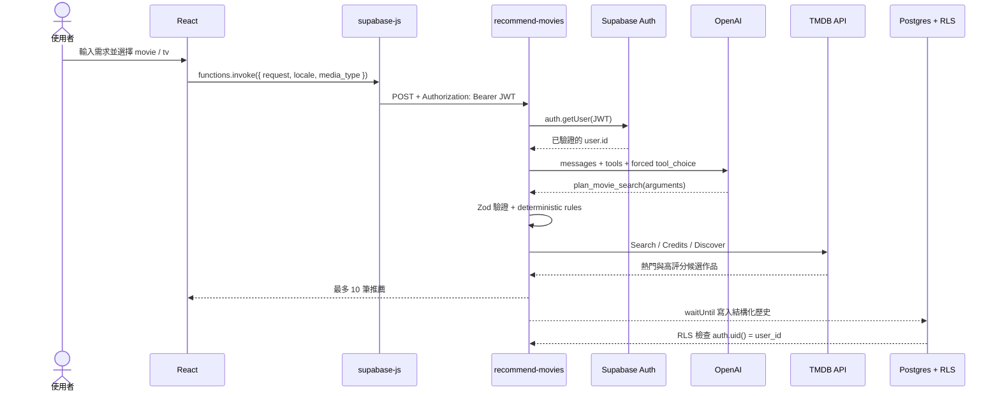
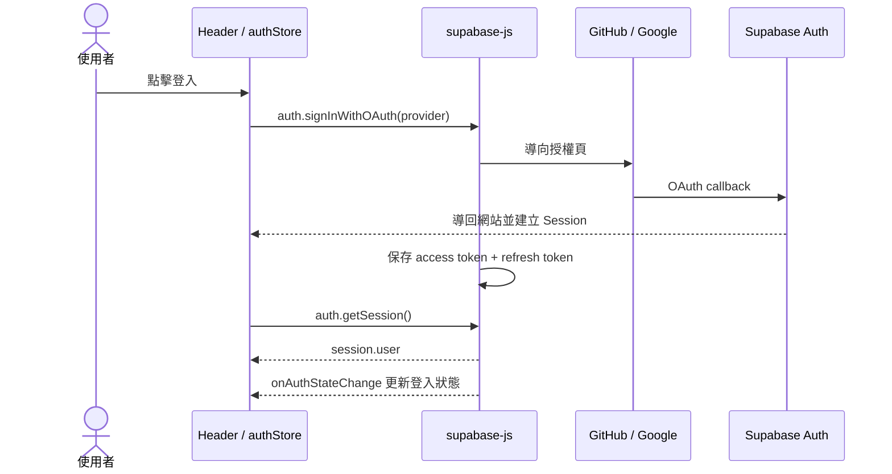

# AI 選片、Supabase Auth 與資料權限架構

[繁體中文](./supabase-ai-rollout.md) | [English](./supabase-ai-rollout.en.md)

這份文件說明 Movie Picker 的 AI 推薦設計、OAuth 登入、Session／JWT 傳遞

## 推薦流程概述

使用者登入後輸入想看片的條件；AI 只負責把自然語言整理成結構化查詢計畫，Edge Function 驗證計畫後再向 TMDB 找片，最後由 Supabase RLS 確保推薦紀錄只能被本人讀寫。

## 系統邊界

| 層級                             | 責任                                                 |
| -------------------------------- | ---------------------------------------------------- |
| React                            | 收集選片需求、顯示登入狀態與推薦結果                 |
| Supabase Auth                    | 完成 GitHub／Google OAuth，建立並更新 Session        |
| `recommend-movies` Edge Function | 驗證使用者、協調 AI 與 TMDB、保存推薦紀錄            |
| OpenAI                           | 把自然語言轉換成受限制的查詢計畫                     |
| TMDB                             | 提供人物、關鍵字、作品與 Discover 資料               |
| Postgres + RLS                   | 保存收藏與推薦歷史，限制每位使用者只能操作自己的資料 |

## AI 推薦呼叫流程

### Function calling 與查詢計畫驗證

這裡的 function calling 不是讓 AI 自己呼叫 TMDB。模型只能回傳 `plan_movie_search` 的參數，真正的 API 呼叫仍由 Edge Function 控制。

目前的重要參數：

| 參數                    | 設定                         | 原因                            |
| ----------------------- | ---------------------------- | ------------------------------- |
| `tools`                 | 只有 `plan_movie_search`     | 限制模型只能建立查詢計畫        |
| `tool_choice`           | 強制指定 `plan_movie_search` | 不接受自由文字回答              |
| `strict`                | `true`                       | 要求輸出符合 JSON Schema        |
| `additionalProperties`  | `false`                      | 禁止增加未定義欄位              |
| `temperature`           | `0`                          | 降低相同輸入產生不同計畫的機率  |
| `max_completion_tokens` | `900`                        | 限制輸出成本與長度              |
| 預設模型                | `gpt-4o-mini`                | 可由 `OPENAI_MODEL` Secret 覆寫 |

Tool Schema 將資料拆成：

- `hard_constraints`：使用者明確提出、搜尋時不能放寬的條件，例如排除類型、年份、片長、語言或國家。
- `soft_preferences`：類型、關鍵字與氣氛偏好，可標示為使用者明說的 `explicit` 或模型推測的 `inferred`。
- `people`：最多兩位演員、導演、編劇或製作人。
- `people_match`：多人條件是任一人符合，或所有人都要共同參與。
- `display_labels`：顯示給使用者看的已套用條件。

模型輸出仍是不可信輸入，所以後端還會：

1. 解析指定 tool call 的 arguments。
2. 用 Zod 驗證型別、字數、陣列上限與電影／影集各自允許的 genre。
3. 套用 deterministic rules，例如「短一點的電影」固定轉為 60～90 分鐘。
4. 若文字明說電影但 UI 選擇影集，回傳 `media_type_mismatch`，不讓模型偷偷改類型。

### 查詢計畫轉換為真實片單

1. 透過 TMDB Search 解析人物與關鍵字；名稱有歧義時不猜測，直接回傳可調整條件的錯誤。
2. 電影演員使用 `with_cast`；導演、編劇、製作人與 TV 人物則檢查 credits 的 department／job，再交集作品 ID。
3. 同時執行 `popularity.desc` 與 `vote_average.desc` 兩個 Discover 查詢。
4. 將兩個結果交錯、去重，建立最多 20 筆候選池，再回傳前 10 筆。
5. 若結果不足，只能移除 AI 推測的 genre／keyword；使用者明說的條件永遠保留。

因此 AI 負責「理解需求」，TMDB 負責「提供真實作品」，程式碼負責「驗證、搜尋與排序」。

## 登入流程

 
 

1. `Providers` 呼叫 `authStore.initializeAuth()`。
2. `getSession()` 建立首次 UI 狀態，`onAuthStateChange()` 處理後續的登入、token 更新與登出。
3. `supabase-js` 呼叫 Function 時附上 Session JWT。
4. Edge Function 透過 `auth.getUser()` 取得已驗證的 `user.id`，不接受前端傳入的使用者 ID。
5. Function 使用呼叫者 JWT 與 anon key 寫入資料，讓推薦紀錄繼續受 RLS 限制。

## 官方參考

- [Supabase Auth Sessions](https://supabase.com/docs/guides/auth/sessions)
- [Supabase Edge Function Authentication](https://supabase.com/docs/guides/functions/auth)
- [Supabase Row Level Security](https://supabase.com/docs/guides/database/postgres/row-level-security)
